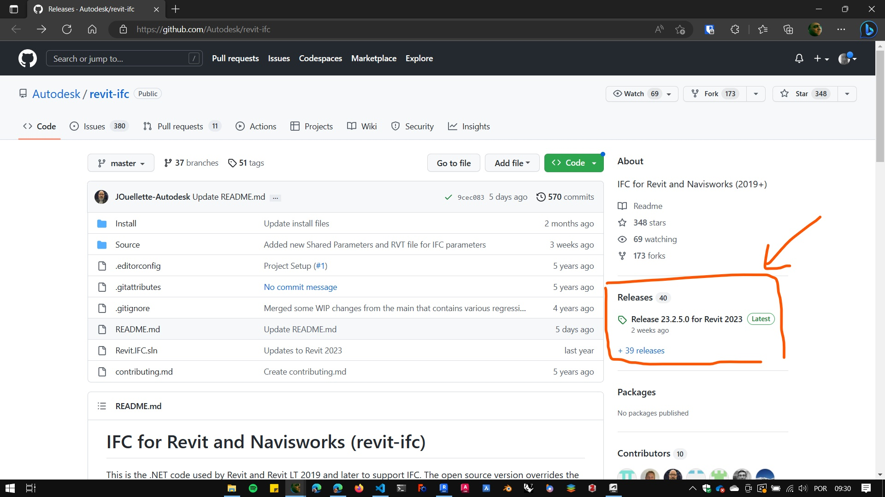
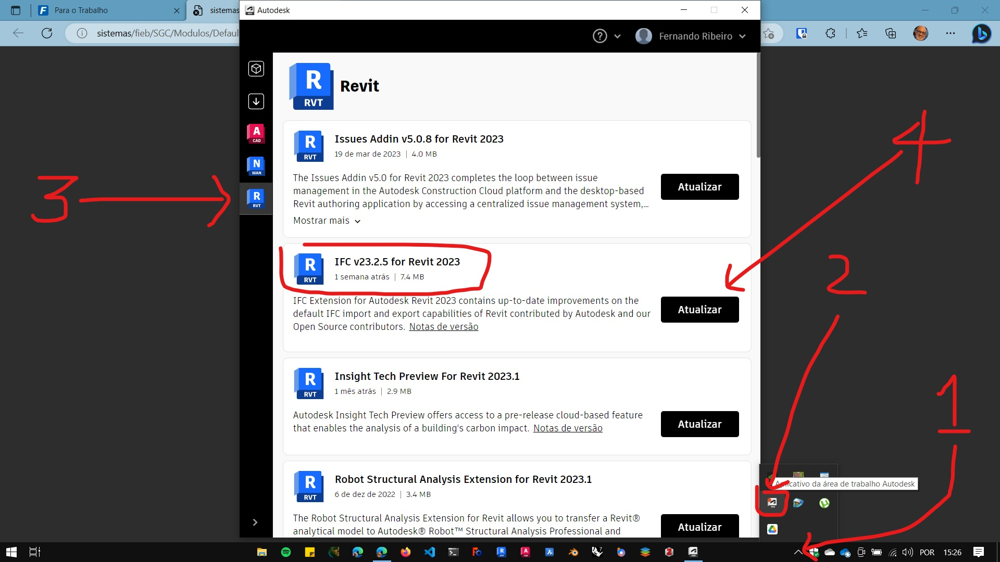

# Atualize o exportador de IFC do Revit

O exportador de IFC do Revit pode ser atualizado de duas maneiras:

## Pelo Github

[Link para download do exportador no github](https://github.com/Autodesk/revit-ifc)

* Acesse o link acima

* Procure o link de **Releases** mais recente.

  
* Baixe o instalador mais recente para a sua versão do Revit.

* Execute o instalador

## Pelo aplicativo da área de trabalho da

* Abra o Apicativo da área de trabalho da autodesk
  
* Clique nas atualizações do Revit

* Procure o IFC vXX.X.X for Revit <versão> (o mais recente)

* Clique em atualizar

