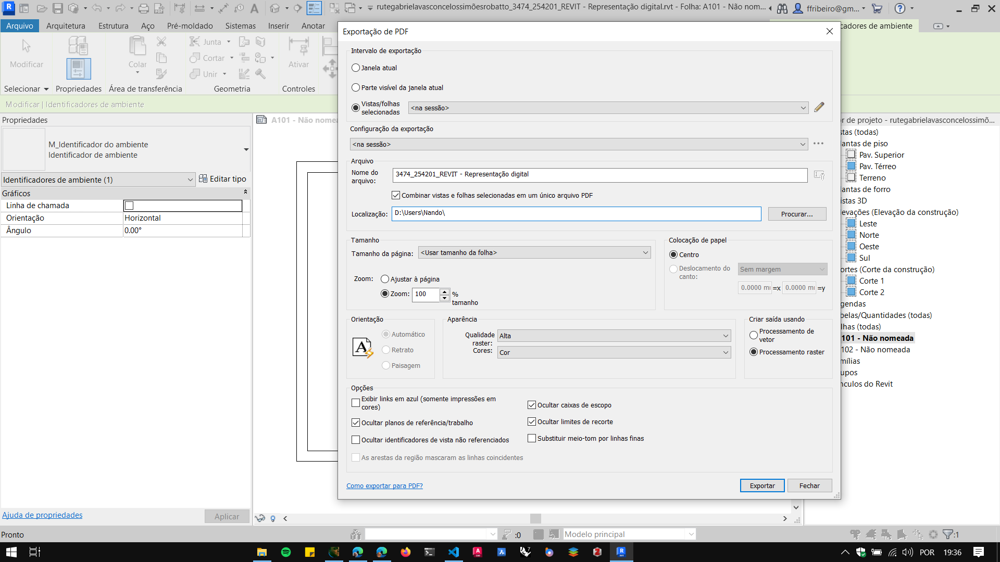

# Configurações de Impressão

A partir da versão 2022 do Revit é possível exportar um projeto para PDF. Na aba arquivo -> Exportar -> PDF

- Abrindo as configurações

- Tela de configuração da exportação
