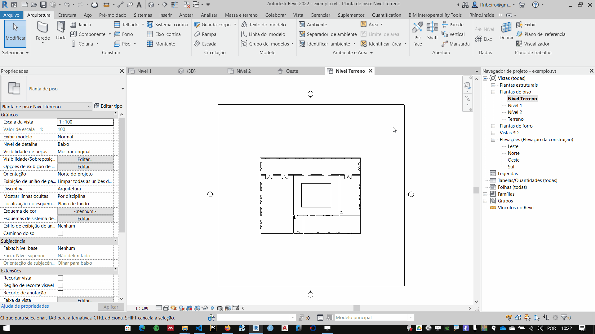
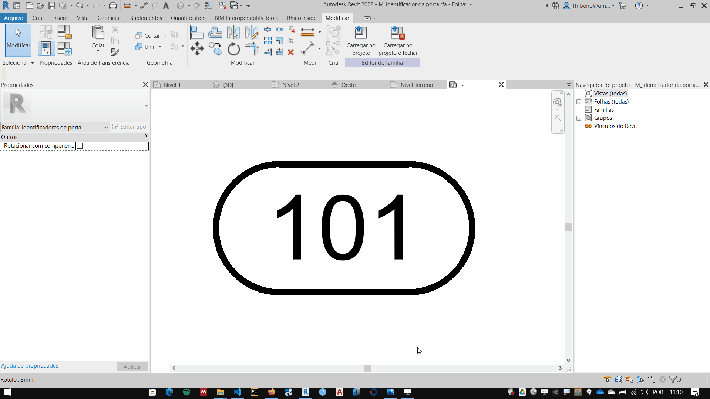
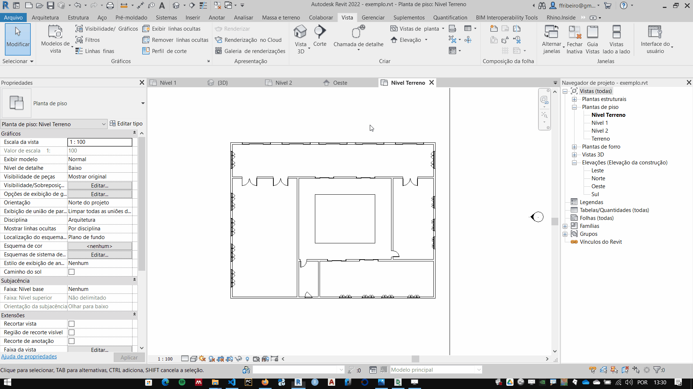

# Identificadores (tags)

## Inserindo identificadores

## Editando Identificadores

### Trocando informação apresentada

1. Edite a familia do identificador
    

1. Edite o rótudo do identificador
    

## Identificando Múltiplos objetos (tag all)

